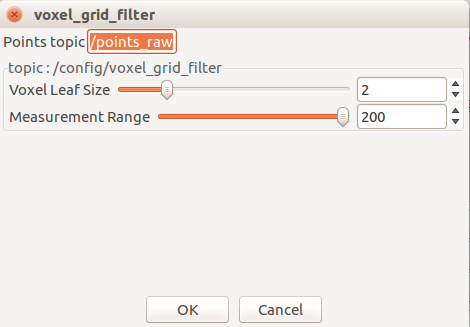
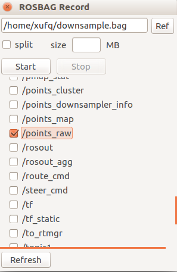
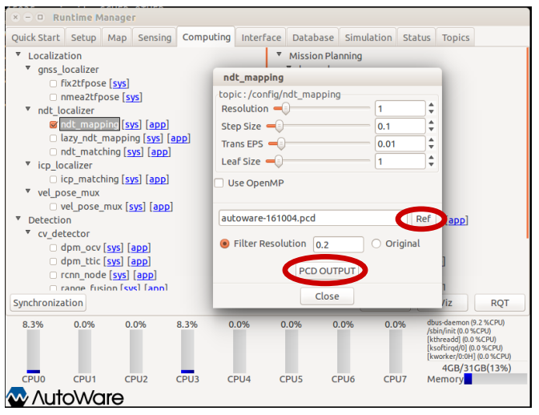
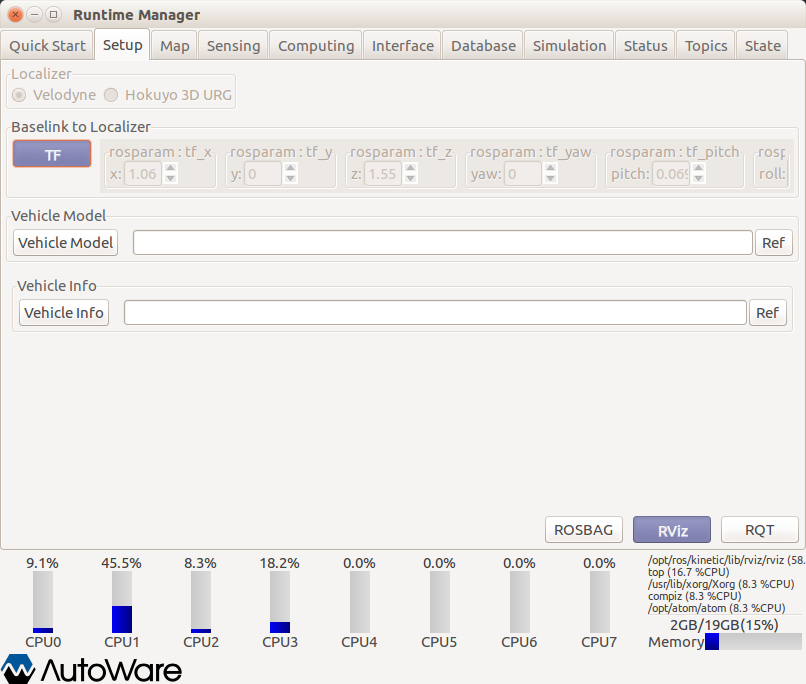
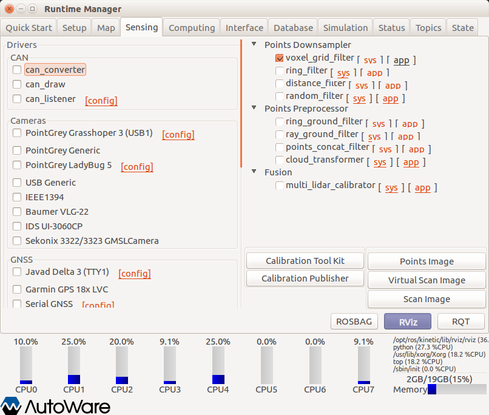
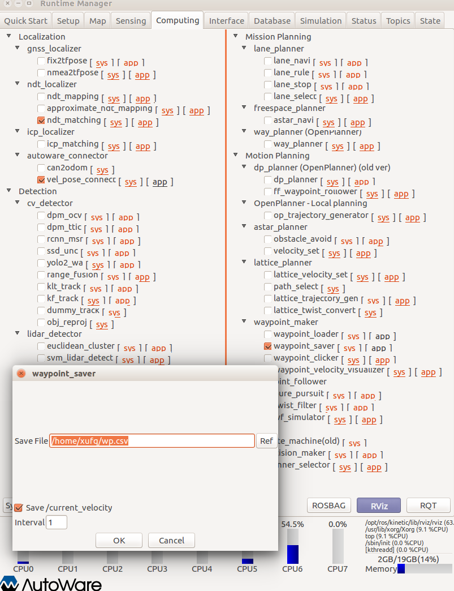
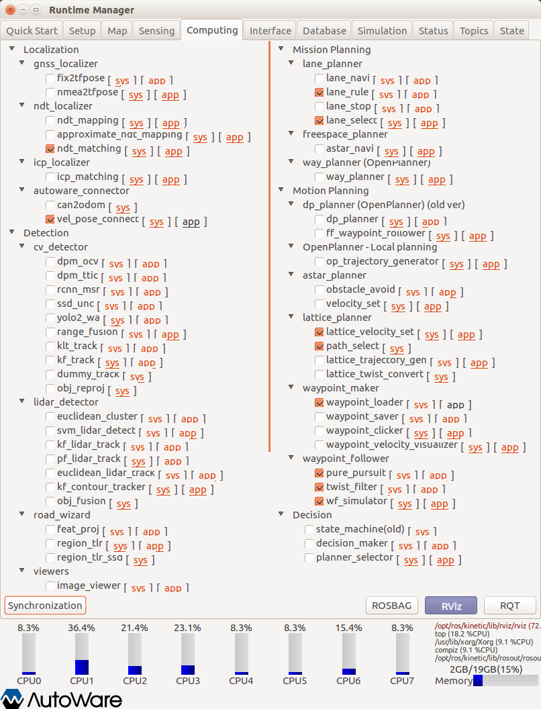
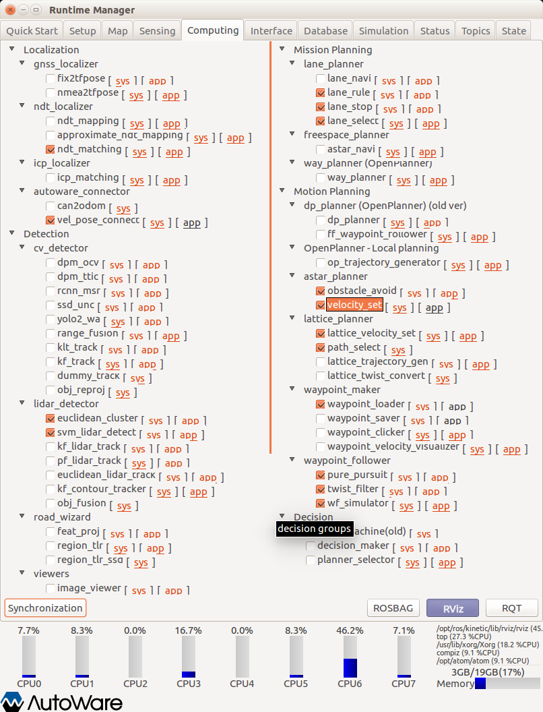

## 极简入门手册


### 主要模块

### Localization
#### lidar_localizar 
   计算车辆当在全局坐标的当前位置(x,y,z,roll,pitch,yaw)，使用LIDAR的扫描数据和预先构建的地图信息。autoware推荐使用正态分布变换(NDT)算法来匹配激光雷达当前帧和3D map。
#### gnss_localizer 
转换GNSS接收器发来的NEMA/FIX消息到位置信息(x,y,z,roll,pitch,yaw)。结果可以被单独使用为车辆当前位置，也可以作为lidar_localizar的初始参考位置。
**dead_reckoner** 主要使用IMU传感器预测车辆的下一帧位置，也可以用来对lidar_localizar和gnss_localizar的结果进行插值。
#### Detection
##### lidar_detector 
从激光雷达单帧扫描读取点云信息，提供基于激光雷达的目标检测。主要使用欧几里德聚类算法，从地面以上的点云得到聚类结果。除此之外，可以使用基于卷积神经网路的算法进行分类，包括**VoxelNet,LMNet**.
##### image_detector 
读取来自摄像头的图片，提供基于图像的目标检测。主要的算法包括R-CNN，SSD和Yolo，可以进行多类别(汽车，行人等)实时目标检测。
##### image_tracker 
使用image_detector的检测结果完成目标跟踪功能。算法基于Beyond Pixels，图像上的目标跟踪结果被投影到3D空间，结合lidar_detector的检检测结果输出最终的目标跟踪结果。
##### fusion_detector 
输入激光雷达的单帧扫描点云和摄像头的图片信息，进行在3D空间的更准确的目标检测。激光雷达的位置和摄像头的位置需要提前进行联合标定，现在主要是基于MV3D算法来实现。
##### fusion_tools
 将**lidar_detector**和**image_detector**的检测结果进行融合，**image_detector** 的识别类别被添加到lidar_detector的聚类结果上。
##### object_tracter
 预测检测目标的下一步位置，跟踪的结果可以被进一步用于目标行为分析和目标速度分析。跟踪算法主要是基于卡尔曼滤波器。
 

---
#### Prediction
##### moving_predictor 
使用目标跟踪的结果来预测临近物体的未来行动轨迹，例如汽车或者行人。
##### collision_predictor
使用moving_predictor的结果来进一步预测未来是否会与跟踪目标发生碰撞。输入的信息包括车辆的跟踪轨迹，车辆的速度信息和目标跟踪信息。

---
#### Misson planning
##### route_planner
 寻找到达目标地点的全局路径，路径由道路网中的一系列十字路口组成。
##### lane_planner 
根据route_planner发布的一系列十字路口结果，确定全局路径由哪些lane组成，lane是由一系列waypoint点组成
##### waypoint_planner 
可以被用于产生到达目的地的一系列waypoint点，它与lane_planner的不同之处在于它是发布单一的到达目的地的waypoint路径,而lane_planner是发布到达目的地的一系列waypoint数组。
##### waypoint_maker 
是一个保存和加载手动制作的waypoint文件的工具。为了保存waypoint到文件里，需要手动驾驶车辆并开启定位模块，然后记录车辆的一系列定位信息以及速度信息， 被记录的信息汇总成为一个路径文件，之后可以加载这个本地文件，并发布需要跟踪的轨迹路径信息给其他规划模块。

---
#### Motion planning
##### velovity_planner 
更新车辆速度信息，注意到给定跟踪的waypoint里面是带有速度信息的，这个模块就是根据车辆的实际状态进一步修正速度信息，以便于实现在停止线前面停止下来或者加减速等等。

##### astar_planner 
实现Hybrid-State A*查找算法，生成从现在位置到指定位置的可行轨迹，这个模块可以实现避障，或者在给定waypoint下的急转弯，也包括在自由空间内的自动停车。
##### adas_lattice_planner 
实现了State Lattice规划算法，基于样条曲线，事先定义好的参数列表和语义地图信息，在当前位置前方产生了多条可行路径，可以被用来进行障碍物避障或车道线换道。
##### waypoint_follower 
这个模块实现了 Pure Pursuit算法来实现轨迹跟踪，可以产生一系列的控制指令来移动车辆，这个模块发出的控制消息可以被车辆控制模块订阅，或者被线控接口订阅，最终就可以实现车辆自动控制。
***
### 官方手册
* [日文版 v1.4 How to use ](/others/photo/Autoware_LP.pdf)
* [简单英文版](/others/photo/Autoware_UsersManual_v1.1.pdf)
* [模块间关系](/others/photo/Autoware+Design+Architecture.pdf)
* [Autoware矢量地图格式](/others/photo/b496edec-3e22-4f5c-9928-25a8ea3010fd.pdf)

---
### 功能介绍
##### Setup


* 设置激光雷达的TF树
* Vehicle model：在RVIZ中的车体信息
  ***
 

* /base_link 所在的坐标系
* 在RVIZ可视化的str
* 显示的尺寸
* urdf文件，建模文件
* joint_state_publisher 加入tf树
***
##### 传感器驱动


*  guid 是需要填入安装具体对象的对应的摄像头出厂编号
*  ip可以设置为静态，从官方工具中查看
*  camera_info_url ： 相机标定的参数，最好用MATLAB工具进行标定
* acquisition rate  ： 摄像头帧率
* 像素格式选择默认
* exposure：曝光参数需要和镜头光圈大小同时调整
* 如果是近焦之后的参数选择默认就好
* 此摄像头驱动 ros package 需要放入相关文件夹后重新编译安装
  
###### 其他驱动
* 雷达驱动IP始终为静态ip，所以直接launch

***
##### 初始数据预处理


  > 分为**点云降采样**，**点云预处理**，**多激光雷达初始矫正**
  * 点云降采样根据情况所需选择合适的算法，只能运行其中一个。大多选择voxel_grid_filter
  * 点云预处理根据不同激光雷达算法选择是否启动。多和lidar trac有关
* Fusion
##### Multi LiDAR Calibrator

This package allows to obtain the extrinsic calibration between two PointClouds with the help of the NDT algorithm.

The `multi_lidar_calibrator` node receives two `PointCloud2` messages (parent and child), and an initialization pose.
If possible, the transformation required to transform the child to the parent point cloud is calculated, and output to the terminal.

###### How to launch

1. **You'll need to provide an initial guess, otherwise the transformation won't converge.**

2. In a sourced terminal:

Using rosrun

`rosrun multi_lidar_calibrator multi_lidar_calibrator _points_child_src:=/lidar_child/points_raw _points_parent_src:=/lidar_parent/points_raw _x:=0.0 _y:=0.0 _z:=0.0 _roll:=0.0 _pitch:=0.0 _yaw:=0.0`

Using roslaunch

`roslaunch multi_lidar_calibrator multi_lidar_calibrator points_child_src:=/lidar_child/points_raw points_parent_src:=/lidar_parent/points_raw x:=0.0 y:=0.0 z:=0.0 roll:=0.0 pitch:=0.0 yaw:=0.0`

3. Play a rosbag with both lidar data `/lidar_child/points_raw` and `/lidar_parent/points_raw`

4. The resulting transformation will be shown in the terminal as shown in the *Output* section.

5. Open RViz and set the fixed frame to the Parent

6. Add both point cloud `/lidar_parent/points_raw` and `/points_calibrated`

7. If the algorithm converged, both PointClouds will be shown in rviz.

###### Input topics

|Parameter| Type| Description|
----------|-----|--------
|`points_parent_src`|*String* |PointCloud topic name to subscribe and synchronize with the child.|
|`points_child_src`|*String*|PointCloud topic name to subscribe and synchronize with the parent.|
|`voxel_size`|*double*|Size of the Voxel used to downsample the CHILD pointcloud. Default: 0.5|
|`ndt_epsilon`|*double*|The transformation epsilon in order for an optimization to be considered as having converged to the final solution. Default: 0.01|
|`ndt_step_size`|*double*|Set/change the newton line search maximum step length. Default: 0.1|
|`ndt_resolution`|*double*|Size of the Voxel used to downsample the PARENT pointcloud. Default: 1.0|
|`ndt_iterations`|*double*|The maximum number of iterations the internal optimization should run for. Default: 400|
|`x`|*double*|Initial Guess of the transformation x. Meters|
|`y`|*double*|Initial Guess of the transformation y. Meters|
|`z`|*double*|Initial Guess of the transformation z. Meters|
|`roll`|*double*|Initial Guess of the transformation roll. Radians|
|`pitch`|*double*|Initial Guess of the transformation pitch. Radians|
|`yaw`|*double*|Initial Guess of the transformation yaw. Radians|

##### Output

1. Child Point cloud transformed to the Parent frame and published in `/points_calibrated`. 
1. Output in the terminal showing the X,Y,Z,Yaw,Pitch,Roll transformation between child and parent. These values can be used later with the `static_transform_publisher`.


###### Output example:

```
transformation from ChildFrame to ParentFrame
This transformation can be replicated using:

rosrun tf static_transform_publisher 1.7096 -0.101048 -0.56108 1.5708 0.00830573  0.843 /ParentFrame /ChildFrame 10
```
The figure below shows two lidar sensors calibrated by this node.
One is shown in gray while the other is show in blue.
Image obtained from rviz.

[Calibration Result](others/photo/calibration_result.jpeg)


***
#### 算法模块
> 暂时用到的（2019/03/19）
> * NDT相关
>  * 视觉识别跟踪
> * 激光雷达识别跟踪
> * 激光-视觉融合设置属性判断碰撞
> * 交通灯识别
 ##### 激光雷达相关


* 具体建图步骤见PDF
* 当数据包播放完成时NDT不一定同时完成建图，需要在Shell查看进度
* 点云地图比较稀疏时，定位容易丢失，调整scan范围比较有效
* 处理方式最好选用pcl_anh_gpu
* 在输出地图PCD时可以时分辨率变大，文件较小
  
  ___

  

***
分割线

***
#这是一个简单示例

## Lidar Velodyne 32C
Velodyne 32C is a new Lidar while driver and calibration file should be updated.

These files has been saved to [Velodyne32C](https://github.com/xfqbuaa/PIX-Hackathon-Autoware/tree/master/Velodyne32c)

### launch file
Copy Velodyne 32C launch file to the following address:
`Autoware/ros/src/sensing/drivers/lidar/packages/velodyne/velodyne_pointcloud/launch/32c_points.launch`

### calibration file
Copy Velodyne 32C calibration yaml file to the following address:
`Autoware/ros/src/sensing/drivers/lidar/packages/velodyne/velodyne_pointcloud/params/VLP-32C.yaml`

### driver
Copy Velodyne 32C driver cc file to the following address:
`Autoware/ros/src/sensing/drivers/lidar/packages/velodyne/velodyne_driver/src/driver/driver.cc`

### factor distance to resolution  
Velodyne 32C factor distance to resolution is different from others Velodyne products, this factor should be modified as following:

1. driver file

`Autoware/ros/src/sensing/drivers/lidar/packages/velodyne/velodyne_pointcloud/src/lib/rawdata.cc`

2. Change
`float distance = tmp.uint * DISTANCE_RESOLUTION;` to
`float distance = tmp.uint * 0.004;`

## How to connect Velodyne Lidar  
* Install ros-velodyne driver:

```
sudo apt-get install ros-VERSION-velodyne
```
* Connect velodyne 32C and disconnect wifi
* Velodyne 32C IP setting
* Robot Cafe car: 192.168.1.201
* Civic: 192.168.0.201
* Computer IP set with in Lidar net, e.g. (robot cafe car 192.168.1.100; Civic 192.168.0.100)  
* View Lidar data

```
roslaunch velodyne_pointcloud 32c_points.launch
rosrun rviz rviz -f velodyne
```
[ROS Velodyne driver install and connect guide](http://wiki.ros.org/velodyne/Tutorials/Getting%20Started%20with%20th)

The computer ip should be set in Lidar net but last not 201 (which is for Lidar).

The Lidars ip can be set same ip.

## How to record rosbag
Make sure you have connected with Lidar successfully and have enough free disk space.
```
roslaunch velodyne_pointcloud 32c_points.launch
rosrun rviz rviz -f velodyne
rosbag record -a
```

## How to generate map and waypoints
* Load simulation rosbag file, play and pause.
* Change rosbag topic name to /points_raw
* The demo.rosbag can be used here for following tutorial.

The above two step can be done with the following commands:

```
rosbag play -r 0.7 bag_name.bag /velodyne_points:=/points_raw
```
You can use space button to stop and play rosbag in ternimal.

* Downsample rosbag files with voxel_grid_filter.



When you click ROSBAG Record stop button, the new downsample rosbag will be saved.
* Change downsample rosbag topic name to /points_raw

```
rosbag play -r 0.7 bag_name.bag /filtered_points:=/points_raw
```
* Active ndt_localizer | ndt_mapping
* waypoint_maker | waypoint_saver
* Run whole simulation rosbag
* Output pcb



* Save waypoints







* The Velodyne default topic name is velodyne_points.
* The downsample rosbag default topic name is filtered_points/
* Please confirm voxel_grid_filter and ROSBAG Record topic name agree with rosbag playing.
* You can check topic data available or not using Autoware Topics.
* Make sure modify app parameters first then active related nodes function.


## How to Simulate
 Here is simulation process and rviz visualization with generated pcb and waypoints file.
 * Setup, sensing
 * Load Map load pcb, waypoints file
 * Computing setting
 * Rviz to simulate
 * If error please check every settings and redo it again.
 * Make sure active vel_pose_connect in Simulation Mode.
 * Make sure waypoint_follower is waypoint.




## How to make self-driving car follow waypoints
* Make sure deactive vel_pose_connect Simulate Mode.
* Make sure deactive waypoint_follower | wf_simulator.


## How to detect obstacle with Lidar
* Make sure velocity_set | Points_topics is points_no_ground.




## Topics in the future
### Autoware Lidar obstacle detection failure on upslope.
* Autoware Lidar obstacle detection function will false detect upslope as obstacle and don't move.

### Police gestures detection
* The dataset should be big and diversity enough to prevent deep learning model over fitting.
* LSTM model has been used instead of CNN model to consider time serial.  
* Police gesture detection have been localized for different countries.

### The robot cafe car CAN control
* Through we have control robot cafe car through CAN, the driving performance is really bad, especially on upslope.
* There are still a lot of improvement potential for vehicle OEM and Tier1 e.g. Bosch to do in the hardware and CAN control.

## Reference
* [Autoware](https://github.com/CPFL/Autoware)
* [Apollo](https://github.com/ApolloAuto/apollo)
* [Busmaster](https://github.com/rbei-etas/busmaster)
* [comma.ai panda](https://github.com/commaai/panda)
* [hdl_graph_slam](https://github.com/koide3/hdl_graph_slam)


